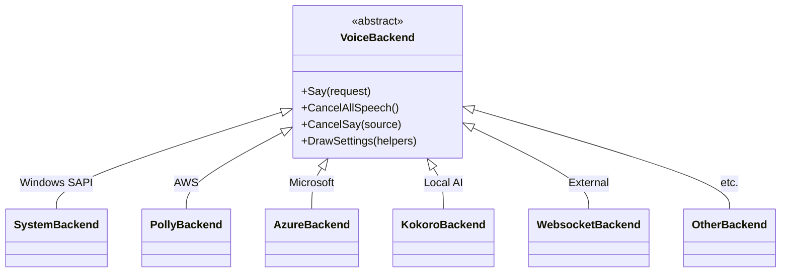

# TTS Backend System

The plugin supports 9 TTS providers through a Strategy pattern, keeping backend-specific code isolated.

All backends inherit from `VoiceBackend`. The `VoiceBackendManager` holds exactly one active backend at a time - when the user switches backends, the old one is disposed and a new one is created.

## Voice Presets

Each backend has its own preset type since voice configuration varies significantly. Presets are stored in a separate JSON file from the main config to keep the preset list from bloating the settings file.

## Sound Queue

Backends push audio items onto a queue that a background thread consumes rather than playing audio directly. This prevents blocking during TTS synthesis (especially for cloud providers), enables cancellation by clearing the queue, maintains message ordering, and tracks the source of each item (chat, dialogue, battle) for selective cancellation.

## Adding a Backend

Create a class inheriting from `VoiceBackend` and a corresponding `VoicePreset` subclass. Add an enum value to `TTSBackend` and the creation case to `VoiceBackendManager.CreateBackendFor()`. Implement `DrawSettings()` to render the backend's configuration UI. The existing backends serve as templates - `SystemBackend` for local TTS, `PollyBackend` for cloud APIs with streaming audio.
