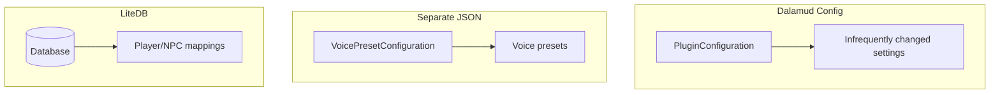

# Configuration Architecture

Configuration is split across three storage mechanisms, each suited to different data characteristics.

**PluginConfiguration** uses Dalamud's built-in config system for core settings: enabled state, backend choice, keybinds, chat type filters, triggers. These are things that might need to be changed manually (serializes to JSON internally) and tend to be small. Using Dalamud's system provides automatic saving and makes the config UI gear button work.

**VoicePresetConfiguration** stores voice presets in a separate JSON file. Users may have dozens of presets, and keeping these separate prevents the main config from growing unwieldy.

**LiteDB** stores player and NPC voice assignments. Users may assign voices to hundreds of characters over time, and these change frequently. A database handles this better than serializing to JSON on every change.

## Migrations

Config format changes between versions. Each migration implements `ShouldMigrate` and `Migrate`. They run in sequence at startup: 1.5, 1.6, 1.17, 1.18.2, 1.18.3, 1.25.0. The 1.25.0 migration moved player/NPC data from JSON into LiteDB.

When adding new config fields, provide a default value to avoid throwing `NullReferenceException` for users with existing config files. When changing existing fields, write a migration and test both fresh installs and upgrades.

## Chat Type Presets

Users can create multiple presets of enabled chat types, for example, having one for dungeons that only reads party chat and a separate one for general use that reads the other chat channels.

## Credential Storage

Cloud TTS providers require API credentials. Rather than storing these in config files, the plugin uses Windows Credential Manager via `AdysTech.CredentialManager`. Each provider has a static credential manager class (e.g., `PollyCredentialManager`, `AzureCredentialManager`) that wraps load/save/delete operations with a provider-specific target string like `TextToTalk_AccessKeys_AmazonPolly`.

Credentials are stored as `NetworkCredential` objects. Providers with two credentials (AWS access key + secret, Uberduck username + password) use both fields. Single-key providers (ElevenLabs, OpenAI) store the API key as the password with a placeholder username. The credential managers are stateless - credentials are always fetched fresh from the system vault rather than cached.

## Voice Preset Serialization

Voice presets are polymorphic - each backend has its own preset type (`SystemVoicePreset`, `PollyVoicePreset`, etc.) with different properties. `Newtonsoft.Json`'s `TypeNameHandling` doesn't work reliably in Dalamud's plugin environment due to assembly-loading restrictions.

Instead, we deal with this manually. On save, presets are converted to untyped dictionaries via reflection (`CorruptPreset`). On load, the `EnabledBackend` property is read to reconstruct the correct concrete type and reassign the appropriate properties (`RepairPreset`).

Most preset types prefix their `JsonProperty` names to avoid collisions (e.g., `SystemVolume`, `PollyVolume`, `AzureVolume`). This also allows for evolving the schema - properties can be renamed while maintaining backwards compatibility with old config files.
