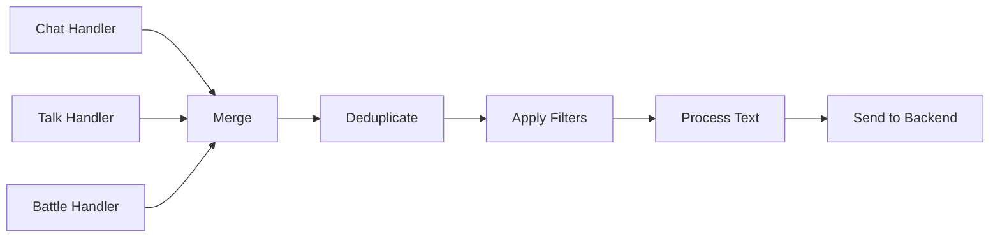
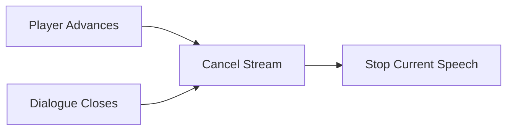

# Event Flow Architecture

Text flows through the plugin via R3 reactive streams, which handle merging multiple asynchronous text sources, deduplication, filtering, and processing.

## Text Sources

The plugin captures text from three game sources, each with its own handler that emits events into the reactive stream:

- **Chat messages**: Player chat, system messages, NPC dialogue in chat, etc.
- **AddonTalk**: The dialogue box during quests
- **AddonBattleTalk**: The floating dialogue box during battles/duties

The stream merges all sources, removes duplicates (same text from same speaker), applies filters (enabled chat types, triggers), processes the text (remove stutters, apply lexicons), and dispatches to TTS.

## Sound Detection

Quest dialogue boxes update their text before the voice line plays. Reading text immediately would cause TTS to speak over the game's own voice acting. The `SoundHandler` hooks into the game's audio loading to detect when voice lines play, signaling the addon handlers to re-poll. This allows the plugin to detect voiced lines and skip TTS accordingly.

## Cancellation

When the player advances dialogue or closes the dialogue box, cancel events flow through a separate stream to stop in-progress TTS:

The sound queue tracks the source of each item, enabling selective cancellation - dialogue TTS can be cancelled without stopping chat TTS.

## Text Processing

Before text reaches the backend, it passes through: formatting removal (color codes, markup), normalization (em-dashes to hyphens), optional stutter removal ("W-well, I..."), token replacement (`{{FULL_NAME}}` with actual player name), and lexicon application. Each step is a pure function.
