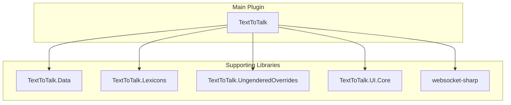

# TextToTalk Design Documentation

## Solution Architecture

The plugin is divided into several separate sub-projects to try and isolate self-contained concerns and force developers to avoid coupling certain components to the main plugin. The main plugin orchestrates everything, while supporting libraries handle more focused domains like data models, lexicon processing, and source generation (for UI components).

## Documents

- [Initialization](initialization.md) - Component startup order and dependency chains
- [Backend System](backend-system.md) - TTS provider abstraction and the sound queue
- [Event Flow](event-flow.md) - Reactive streams from game text to speech
- [Configuration](configuration.md) - Multi-layer storage and migrations
- [Lexicon System](lexicon-system.md) - Custom pronunciation injection
- [UI Architecture](ui-architecture.md) - Backend UI delegation pattern
