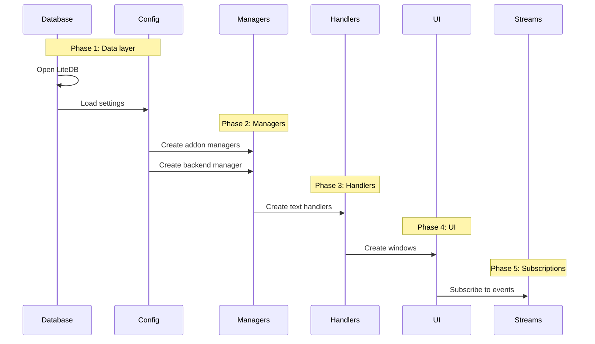

# Plugin Initialization

Components initialize in a specific order to satisfy dependency chains.

The database opens first because the config migration system may need to move data into LiteDB (the 1.25.0 migration moved player/NPC mappings out of JSON). Managers come next since text handlers depend on them to poll game state and dispatch TTS requests. The UI initializes last since the configuration window needs references to services, managers, and handlers. Observable subscriptions are set up at the end once all pieces exist.

Disposal happens in reverse order. Stream subscriptions are disposed first to stop new events from flowing, preventing null reference exceptions from events arriving during teardown.

When adding a new service or manager, initialize it after its dependencies and add it to disposal in reverse order. If it produces events, wire up subscriptions in the streams phase.
