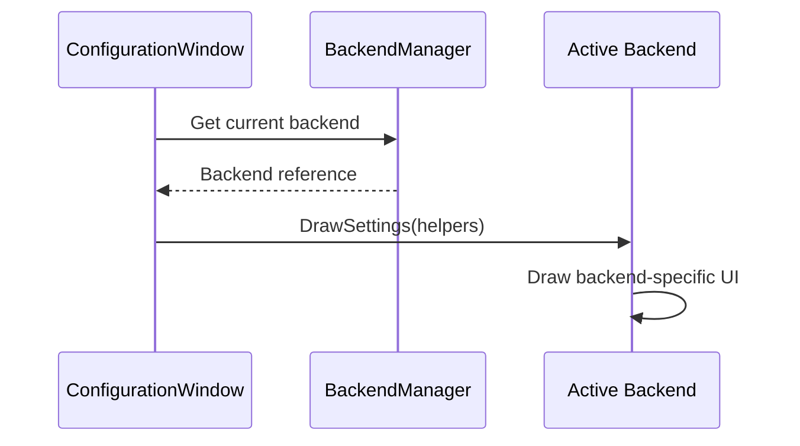

# UI Architecture

Each TTS backend provides its own settings UI through a delegation pattern.

## Backend UI Delegation

Each backend has different configuration needs: While most backends need a voice dropdown and voice sliders, Polly also needs AWS credentials and a region picker (similar patterns apply across the cloud-based backends). The WebSocket backend also has a unique use case, and only needs inputs for the broadcast address and port number, forgoing even a voice dropdown.



Rather than handling all backends in the main window, each backend implements its own `DrawSettings()`.

## Window Communication

Separate ImGui windows communicate through R3 observables rather than holding direct references. For example, ConfigurationWindow emits a "preset open requested" message which ChannelPresetWindow subscribes to, keeping them relatively decoupled from each other.

## Stable Widget IDs

ImGui needs stable widget IDs. The `MemoizedId` helper generates stable IDs from the source file's name and line number to avoid unintentional collisions. While it's not used 100% of the time, we usually use it when there's no obvious unique name for a UI widget, or when such a name would be unnecessarily long.

## Generated Config Components

The `TextToTalk.UI.SourceGeneration` project contains a Roslyn source generator that creates ImGui checkbox methods for boolean config properties. A partial class marked with `[UseConfigComponents(typeof(PluginConfiguration))]` gets generated methods like:

```csharp
public static void ToggleUseKeybind(string label, PluginConfiguration config)
{
    var value = config.UseKeybind;
    if (ImGui.Checkbox(label, ref value))
    {
        config.UseKeybind = value;
        config.Save();
    }
}
```

Properties with a `[Tooltip]` attribute get automatic hover text rendering added to their generated method. The config type must implement `ISaveable` so the generator knows how to persist changes.

This eliminates the boilerplate of writing nearly-identical checkbox methods for every boolean setting. Adding a new boolean property to `PluginConfiguration` automatically makes a corresponding `Toggle*` method available in `ConfigComponents`.
